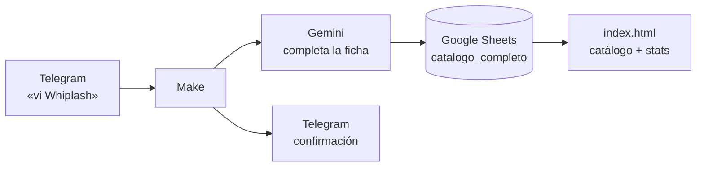

# Diario de proyección

Un registro personal de películas — ~1.280 vistas desde enero de 2018 — que se
mantiene solo: le mandás el nombre de una película a un bot de Telegram, una IA
le completa director, año, país y género, y la fila se agrega a una hoja de
Google. Un sitio web lee esa hoja en vivo y muestra el catálogo y sus
estadísticas.

**Sitio:** https://arturogrottoli.github.io/IA-Automation-Movies/

Proyecto integrador del curso **IA Automation** (Coderhouse). Toca las tres capas
del stack: datos, orquestación e inteligencia.

## Estado

**Funcional de punta a punta.** El circuito Telegram → IA → Google Sheets → web
anda solo: agregás una película por chat y aparece en el sitio sin tocar nada más.

Todavía en desarrollo — el proyecto no está terminado:

**Funcionalidad**
- [ ] **Consultas al bot.** Preguntarle "¿qué vi de Cronenberg?" y que responda
      leyendo la hoja.
- [ ] **Recomendaciones.** Que sugiera películas *no vistas* a partir de un
      director o un género.
- [ ] **Human-in-the-loop.** Que el bot muestre la ficha con botones
      *Aprobar / Editar / Rechazar* antes de guardar.
- [ ] **Diagrama de arquitectura** (entrega PE1 del curso).

**Deuda técnica**
- [x] Limpiar `cerebro/` — hecho. La fuente de verdad es la hoja de Google.
- [ ] Limpiar del catálogo unas filas con fecha de visionado mal cargada.
- [ ] Evaluar migrar el sitio a un framework (React / Next / Astro). Hoy es un
      HTML plano sin dependencias ni build, y para lo que hace (tabla + 4
      gráficos leyendo un CSV) funciona bien y carga al instante. Tendría sentido
      si el sitio crece mucho, o como pieza de portfolio que demuestre ese stack.

## Cómo funciona



| Capa | Herramienta | Rol |
|---|---|---|
| **Cerebro** | Google Sheets | El catálogo. Una tabla, 17 columnas. |
| **Corazón** | Make | Escucha el bot, llama a la IA, escribe la fila. |
| **Inteligencia** | Google Gemini (`extract structured data`) | Del título → director, año, país, género, sinopsis. |
| **Voz** | Telegram + `index.html` | Entrada por chat; salida por web. |

El sitio es un solo archivo, sin dependencias ni build. Lee el CSV publicado de la
hoja; si no hay conexión, cae a una instantánea embebida.

## Estructura

```
index.html            el sitio (catálogo navegable + 4 gráficos + índice completo)
cerebro/
  catalogo_completo.csv   copia portable de las ~1.280 películas
  build_site.js           baja la hoja publicada y refresca la instantánea de index.html
  CONFIG.md               dónde vive cada secreto (todos en Make, ninguno acá)
  README.md               notas sobre los datos
```

## Datos en vivo

1. En la hoja: *Archivo → Compartir → Publicar en la Web → pestaña
   `catalogo_completo` → CSV*.
2. Pegar esa URL en `SHEET_CSV_URL`, arriba del `<script>` de `index.html`.

Sin eso, el sitio funciona igual con la instantánea (`node cerebro/build_site.js`
la actualiza).
