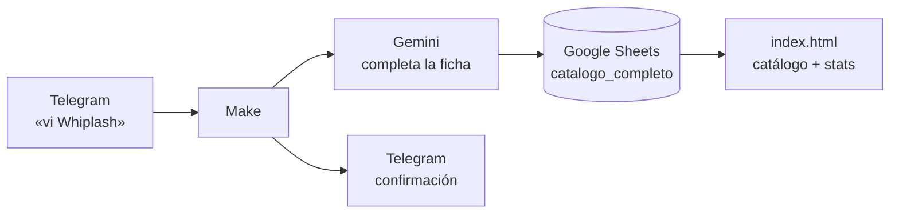

# Diario de proyección

Un registro personal de películas — ~1.280 vistas desde enero de 2018 — que se
mantiene solo: le mandás el nombre de una película a un bot de Telegram, una IA
le completa director, año, país y género, y la fila se agrega a una hoja de
Google. Un sitio web lee esa hoja en vivo y muestra el catálogo y sus
estadísticas.

**Sitio:** https://arturogrottoli.github.io/IA-Automation-Movies/

Proyecto integrador del curso **IA Automation** (Coderhouse). Toca las tres capas
del stack: datos, orquestación e inteligencia.

## Cómo funciona



| Capa | Herramienta | Rol |
|---|---|---|
| **Cerebro** | Google Sheets | El catálogo. Una tabla, 17 columnas. |
| **Corazón** | Make | Escucha el bot, llama a la IA, escribe la fila. |
| **Inteligencia** | Google Gemini (`extract structured data`) | Del título → director, año, país, género, sinopsis. |
| **Voz** | Telegram + `index.html` | Entrada por chat; salida por web. |

El sitio es un solo archivo, sin dependencias ni build. Lee el CSV publicado de la
hoja; si no hay conexión, cae a una instantánea embebida.

## Estructura

```
index.html            el sitio (catálogo navegable + 4 gráficos + índice completo)
cerebro/
  catalogo_completo.csv   las 1.280 películas — lo que se importa a Sheets
  peliculas_import.csv    históricos 2018–2025 (fuente)
  pelis_2026.csv          las 203 de 2026, verificadas a mano (fuente)
  build_catalogo.js       une las dos fuentes → catalogo_completo.csv
  build_2026.js           genera pelis_2026.csv
  build_site.js           refresca la instantánea embebida en index.html
  CONFIG.md               dónde vive cada secreto (todos en Make, ninguno acá)
  README.md               detalle del pipeline de datos
```

## Datos en vivo

1. En la hoja: *Archivo → Compartir → Publicar en la Web → pestaña
   `catalogo_completo` → CSV*.
2. Pegar esa URL en `SHEET_CSV_URL`, arriba del `<script>` de `index.html`.

Sin eso, el sitio funciona igual con la instantánea (`node cerebro/build_site.js`
la actualiza).
