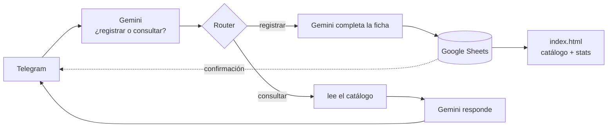

# Diario de proyección

Un registro personal de películas — ~1.280 vistas desde enero de 2018 — que se
mantiene solo: le mandás el nombre de una película a un bot de Telegram, una IA
le completa director, año, país y género, y la fila se agrega a una hoja de
Google. Un sitio web lee esa hoja en vivo y muestra el catálogo y sus
estadísticas.

**Sitio:** https://turimoviesdatabase.vercel.app

Proyecto integrador del curso **IA Automation** (Coderhouse). Toca las tres capas
del stack: datos, orquestación e inteligencia.

**La historia completa del proyecto** — por qué, en qué orden, qué se rompió y
qué se aprendió en el camino — está en
[docs/historia-del-proyecto.md](docs/historia-del-proyecto.md).

## Estado

**Funcional de punta a punta.** El circuito Telegram → IA → Google Sheets → web
anda solo: agregás una película por chat y aparece en el sitio sin tocar nada más.

### Hecho
- [x] **Registro por chat.** "vi Whiplash" → IA completa la ficha → fila en la hoja.
- [x] **Sitio + estadísticas** en vivo (6 gráficos + índice paginado).
- [x] **Actores/actrices más vistos** (de TMDB, junto a directores).
- [x] **Duración y sinopsis por película** (`runtime.json`/`synopsis.json`, de
      TMDB) + modal de detalle: click en cualquier película (tabla, grilla o
      "quiero ver") abre la ficha completa — póster, género, rating,
      duración, sinopsis, reparto y todas las fechas vistas.
- [x] **Consultas al bot.** "¿qué vi de Cronenberg?" → responde leyendo la hoja.
- [x] **Recomendaciones.** "recomendame un thriller" → sugiere pelis no vistas.
- [x] **Pósters, ratings y géneros (TMDB).** Grilla de tarjetas + gráfico y
      filtro por género + columna de rating.
- [x] **Lista "quiero ver".** "quiero ver X" → pestaña `por_ver` + sección en el
      sitio; al registrarla como vista sale sola de la lista.
- [x] **Human-in-the-loop.** "vi X" → el bot muestra la ficha con botones
      **✅ Sí / ❌ No**; recién guarda (como `Aprobada`) cuando tocás ✅.
- [x] Limpieza de `cerebro/` y del repo.

### Pendiente — funcionalidad
- [x] **HITL: el botón ❌.** Router → `editMessageText` ("❌ Descartada") →
      `answerCallbackQuery`. Ya no guarda nada en la hoja e incluye el mensaje
      de recuperación ("si fue sin querer, mandala de nuevo").
- [ ] **Aviso de título homónimo.** Al registrar "X" que ya existe en el catálogo
      con otro director/año, que el bot avise: "ya tenés *X* (De Palma, 1976); esta
      es de Kimberly Peirce, 2013 — ¿la agrego igual?". Evita falsos duplicados y
      marca cuándo es una revisión de verdad.
- [x] **Título ambiguo (ej. "cape fear"), con botones.** Cuando el título tiene
      más de una película conocida (remake, versión vieja), el bot pregunta
      cuál es con 2 botones antes de proponer la ficha. Probado en vivo,
      punta a punta (elegís opción → ficha final → ✅ → guardada).
      Cómo quedó armado, por si hay que tocarlo:
      - Módulo 6 (Gemini): schema `ambiguo`/`opcion1`/`opcion2`.
      - Router 7, ruta "1st Registrar": `intent = registrar` AND `ambiguo`
        not equal `true` (para no disparar el mensaje normal si es ambigua).
      - Router 7, ruta "Ambiguo" (`intent = registrar` AND `ambiguo = true`):
        Telegram Bot (Make an API Call, sendMessage) con 2 botones (1️⃣/2️⃣),
        `callback_data` = `"amb:" + opción completa` (título/año/director en
        el mismo string, no un código corto — así no hace falta guardar
        estado entre mensajes).
      - Router 18, ruta "Ambiguo elegido" (`Callback Query: Data` starts with
        `amb`) → Text parser (sin uso real, quedó de un diseño anterior) →
        Gemini nuevo (módulo 31, schema de 5 campos) que arma la ficha
        completa recibiendo directo `{{2.callbackQuery.data}}` como mensaje
        (a Gemini no le cuesta nada ignorar el prefijo "amb:") → Telegram Bot
        con el mensaje final ✅/❌, con el mismo formato y `callback_data`
        ("ok"/"no") que el registro normal — así cae solo en las rutas
        "Aprobado"/"Rechazado" que ya existían, sin duplicar esa parte.
      - Bug de plataforma encontrado en el camino: el buscador de campos de un
        módulo de IA no muestra los campos nuevos del schema hasta que el
        módulo corre al menos una vez con datos reales — se resuelve con
        "Run this module only" escribiendo un mensaje a mano en el input.
- [x] **Sacar el módulo temporal** `Make an API Call` (#21, el del `setWebhook`)
      del escenario de Make — borrado.
- [x] **Que las consultas vean la lista "quiero ver".** HTTP nuevo (33) baja
      `por_ver`, y el Gemini de consultas ahora recibe las dos listas (vistas
      + pendientes) y sabe distinguirlas. Probado con "qué tengo pendiente
      por ver".
- [ ] **Sacar pelis de la lista por bot.** Hoy: borrar la fila en la pestaña
      `por_ver` a mano. Automático = intent `descartar` + Search/Delete Row en Make.
      Sumarle: que al registrar "vi X" con éxito, si X ya estaba en `por_ver`,
      se borre esa fila sola (hoy solo se "esconde" en el sitio, sigue en la hoja).
- [x] **Agregar/quitar de "quiero ver" desde el sitio.** Escenario nuevo en
      Make ("Integration Webhooks"): Custom webhook → Router por `accion`
      ("agregar" → Add a Row en `por_ver`; "quitar" → Search Rows + Delete a
      Row). El modal tiene el botón correspondiente según si la película ya
      está en la lista o no (`openModalAny` decide qué modal mostrar).
      Probado en vivo de punta a punta (agregar + quitar, confirmado en la
      hoja). De paso, el reparto en el modal pasó de texto plano a pills.
      Sumado después: botón ✕ directo en las cards de "Quiero ver" (solo ahí,
      no en las vistas) para sacarlas sin pasar por el modal — pide
      confirmación y pega al mismo webhook. Visible al hover en desktop,
      siempre visible en touch. Probado con CDP (headless Chrome): el click
      no abre el modal (`stopPropagation`), la card desaparece de la grilla
      tras confirmar. El `confirm()` nativo del navegador se reemplazó por un
      modal propio (mismo estilo del sitio). También se sumó un botón
      "+ Agregar película" en la sección, con un formulario para anotar
      cualquier título nuevo sin depender de que ya aparezca en el catálogo
      o en "Parecidas"; la sección ahora se muestra siempre, incluso con la
      lista vacía. En el modal de detalle, el botón de quitar pasó de texto
      abajo de todo a un botón "Quitar de la lista" al lado del título.
      **La rama "agregar" ahora pasa por Gemini antes de escribir la fila**
      (mismo patrón que el bot de Telegram): se agregó un módulo "Extract
      structured data" que recibe el título tal cual lo escribió el usuario
      y devuelve título corregido, director, año, país y género en un solo
      llamado — el Add a Row quedó remapeado para tomar esos campos en vez
      de los crudos del webhook. Por eso el formulario del sitio se
      simplificó a un solo campo ("¿Qué querés ver?"): ya no hace falta
      tipear director/año a mano, igual que escribirle al bot. Probado
      contra el webhook real: mandando solo "parasite" la fila se completó
      sola (Bong Joon-ho, 2019, Corea del Sur, Thriller).
      **Gotcha nuevo:** en el schema de "Response Schema" de Gemini, el
      campo "Property Name" de cada item hay que escribirlo a mano (texto
      literal) — si mapeás ahí un valor de otro módulo (por error, con el
      picker), Gemini usa ese valor como nombre de clave en vez de como
      contenido, y todo sale mal armado.
- [ ] **Pósters de la watchlist automáticos.** Hoy `build_posters.js` los trae al
      re-correrlo a mano; sumar un paso de TMDB a la rama `agendar`/`agregar`
      de Make (HTTP call por título+año, guardar poster/género como columnas
      nuevas en `por_ver`). **A propósito sin tocar todavía** — esperar a que
      se renueven los créditos de Make este mes antes de sumar otro paso al
      escenario.
- [ ] **Similitud por embeddings.** "pelis parecidas a X", "director parecido a otro".
- [x] Los 9 títulos que TMDB no tiene — todos con imagen a mano en `img/`.

### Pendiente — parte de data science
El proyecto sirve tanto para el portfolio de automatización como para el de
datos: el trabajo de limpieza (fechas, pósters, typos) ya es data engineering
real, solo faltaba mostrarlo.
- [x] **Placa V "Detrás de los datos".** Caso de limpieza con números reales
      (604 fechas, 40 pósters, 13 duplicados, 65 directoras) + metodología.
- [x] **Perfil de gusto, en el sitio.** `cerebro/taste_profile.py`
      (Python/pandas/sklearn), corre offline, escribe `taste_profile.json`.
      Se muestra en el sitio como su propia placa — Placa VII "Lo que mis
      películas dicen de mí" ([app/src/app/taste-profile](app/src/app/taste-profile)) —
      no interactiva por película, prosa fija (escrita a mano, no generada
      en runtime; la narración por Gemini en vivo queda pendiente de Make)
      interpolando los números reales vía `TasteProfileService`.
      Última corrida (2026-09-20, 1.155 películas únicas): Tarantino 63,6%
      de tasa de revisión (vs 17,9% del mejor género solo, Animación) — el
      director pesa mucho más que el género. Chad Stahelski 57,1%. La
      década más fuerte es 2000s (13,6%), no 2010s. El modelo marca la
      **duración** como la variable de más peso para predecir revisión,
      pese a que el promedio es casi idéntico entre revisitadas y no
      (109,8 vs 110,0 min) — relación no lineal: el rango 160+ min tiene la
      tasa más alta (18,4%), pero es casi todo Scorsese/Tarantino — la
      duración es proxy del director, no la causa.
      Falta (sin scopear todavía):
      - Combos director+actor (ej. Scorsese+DiCaprio), no solo director solo.
      - Clustering de "familias de gusto" por año, para ver si cambió en 9 años.
      - Ahí sí, una versión del recomendador ajustada por este perfil, para
        comparar contra la de contenido puro del modal (no para reemplazarla).
      Descartado (no interesa): cruzar tasa de revisión contra rating de TMDB.
- [x] **"Películas parecidas a X" por similitud.** `cerebro/build_similar.py`
      (similitud por coseno, director x3 + reparto x2 + género x1 + década
      x0.5, incluye catálogo + "quiero ver", 1.212 películas). Se muestra en
      el modal de detalle (las dos secciones) como chips clickeables.
      **Decisión:** esto queda tal cual, es la capa de automatización/sitio
      — no se ajusta con el perfil de gusto acá. La versión ajustada va
      aparte, como pieza de Data Science (ver abajo), no mezclada en el modal.

#### Ideas para ampliar (sin scopear todavía)
La idea general: tres capas visibles — **Automation + IA → Data Science →
aplicación final** — sin tocar la automatización que ya funciona; la segunda
mitad se suma como módulo aparte, empezando por el perfil de gusto.

- [x] **Duración por película.** `runtime.json` (1.222/1.229, `cerebro/build_runtime.js`,
      mismo patrón que actores/pósters). Falta usarla en algún gráfico del
      sitio y en el recomendador de abajo.
- [ ] **Recomendador con 2 métodos, comparados.** Por contenido (género +
      director + actores + década + país + duración) vs. ese mismo resultado
      ajustado por el perfil de gusto — mostrar los dos lado a lado, no solo
      el ajustado.
- [ ] **El bot reconoce películas por descripción vaga.** "vi una de Scorsese
      con DiCaprio de mafiosos" → la IA arma candidatos y pregunta cuál, en
      vez de necesitar el título exacto. Extiende el mecanismo de "título
      ambiguo" que ya existe (Cape Fear) a un caso más abierto.
- [ ] **La IA como interfaz de consulta a los datos.** "¿qué género veo más?",
      "¿estoy viendo películas más largas últimamente?" — el bot no inventa
      la respuesta: dispara el análisis Python/pandas real sobre los datos y
      Gemini solo la traduce a lenguaje natural. Distinto de "consultar" hoy
      (que lee el CSV crudo) — acá pasa por el análisis primero.
- [x] **Dashboard más profundo** → Placa VI en el sitio
      ([app/src/app/dashboard](app/src/app/dashboard)). Duración promedio
      por año, distribución de duración (histograma), rating promedio por
      género, estacionalidad por mes del año (interpretación de "evolución
      mensual" — una línea de tiempo mes a mes real, ~100 puntos en 9 años,
      no entra en el gráfico de barras que existe hoy), y vistas vs.
      pendientes por década. Todo calculado con signals sobre datos ya
      cargados, sin JSON nuevo. "País vs. género" y "correlaciones" quedaron
      afuera — no entran en el vocabulario de gráfico de barras actual
      (harían falta un heatmap o un scatter, no construidos todavía).
- [x] **Sección "Lo que mis películas dicen de mí"** → ver el ítem de
      arriba, "Perfil de gusto, en el sitio". La versión narrada por Gemini
      en vivo (en vez de la prosa fija actual) queda pendiente de Make.

### Pendiente — para cerrar el curso
- [x] **Mapa de arquitectura** → [docs/arquitectura.md](docs/arquitectura.md) / [PDF](docs/arquitectura.pdf).
- [x] **Manual de datos** → [docs/manual-de-datos.md](docs/manual-de-datos.md) / [PDF](docs/manual-de-datos.pdf).
- [x] **Optimización de costos** → [docs/costos.md](docs/costos.md) / [PDF](docs/costos.pdf).
      Los 3 documentos estaban desactualizados (faltaban las ramas
      agendar/ambiguo, el escenario "Integration Webhooks", el modelo real,
      y `manual-de-datos.md` describía como "pendiente" el bug de
      `anio_visto` que ya se arregló) — corregidos. **Los PDF quedaron sin
      re-exportar** (a propósito, no es prioridad ahora).
- [ ] **Error Handler en Make** (si Gemini falla, hoy se pierde la fila).
- [~] **Panel de KPIs de operación** → [docs/kpis-operacion.md](docs/kpis-operacion.md)
      y en el sitio (Placa VI, al final de la página). Solo **volumen** (15
      registros vía bot, 1,07/día en las últimas 2 semanas) es calculable hoy
      — **tasa de aprobación** y **errores** necesitan datos que el sistema
      no registra en ningún lugar accesible (el ❌ del HITL no escribe nada
      en la hoja a propósito, y todavía no hay Error Handler). Documentado
      en detalle por qué en el doc.
- [~] **Video demo de 3 min.** Se hace aparte, en YouTube, no como parte del
      trabajo del proyecto — no es un pendiente activo.

### Deuda técnica menor
- [x] **Fechas de visionado (`fecha_vista`) con el año corrido.** Los 8
      bloques + 4 typos sueltos, corregidos con una fórmula en una columna
      auxiliar (R) y pegado especial (solo valores) sobre G. `anio_visto` ya
      coincide en todas las filas. Ojo con 2 cosas que salieron mal en el
      camino, por si se repite el patrón alguna vez:
      - Pegar con Ctrl+V normal en vez de Ctrl+Shift+V rompe todo (la fórmula
        quedaba circular, `#REF!` en toda la columna) — pegado especial,
        siempre.
      - El pegado especial trajo el formato de fecha de la columna auxiliar
        (D/M/AAAA) en vez del de la hoja (AAAA-MM-DD) — hubo que reformatear
        `G2:G1287` a mano (Formato → Número → Fecha personalizada).
      Verificado en el CSV publicado: 0 mismatches en las 1.288 filas.
      Instantánea embebida del sitio ya refrescada con los datos corregidos.
- [x] **Celdas con año/director mal** (de `cerebro/check_datos.js`, verificadas).
      `D713` `E733` `E509` `E551` `E342` `E1000` `D942`/`E942` `E659` `E674` `E1064`.
- [x] **`por_ver`:** Amarga Navidad y Charly días de sangre, ya completas.
- [x] **`por_ver` tenía 3 pelis ya vistas** — The Other y Bob & Carol & Ted &
      Alice, borradas. Rear Window se deja a propósito (la quiere volver a ver).
- [x] **2 typos de país** en `catalogo_completo`: `F794` Corea del Sur ·
      `F716` Hong Kong.
- [x] **Obsession (fila 1246):** era la de terror de 2026 (Curry Barker), no
      la de De Palma — corregida.
- [x] **Fila 340 (Pelham):** "The taking of pelham 123" → "The Taking of
      Pelham One Two Three", para agrupar con la fila 1177.
- [ ] `posters.json` matcheó mal más pelis (remakes/homónimos) — 43 corregidos
      hasta ahora (`cerebro/rematch_posters.js` y `rematch_posters2.js`,
      eligen por director en vez de por popularidad). Última corrección:
      "Fuck You" (2024) tenía matcheada "Fuck You, Cupid" (ficción de Felipe
      Marinheiro) en vez del documental real, "Fuck you! El último show"
      (José Luis García) sobre el último recital de Sumo en Obras — mismo
      título, director completamente distinto, no detectable por alfabeto.
      Última pasada de `check_datos.js`: 20 alertas, las 19 restantes
      revisadas — falsos positivos por nombres de director en otro alfabeto,
      o casos de año ambiguos de muy baja prioridad (festival vs. estreno
      general). Cerca del techo de lo que este método encuentra solo; lo que
      queda requeriría revisión manual. 2 sin match real en TMDB
      (Leaving Neverland, La casa de la playa — no están cargadas como
      película ahí). Quedan más sueltas; se van encontrando con `check_datos.js`.
      **Pasada nueva (2026-09-20): 19 alertas, las 19 revisadas.** 16 son el
      mismo falso positivo de siempre (director en cirílico/chino/japonés/
      coreano/télugu/griego). De los 3 años marcados, 2 confirmaron que el
      catálogo tenía razón — TMDB comparaba contra un relanzamiento, no el
      estreno real: "Historia de lo oculto" (catálogo 2020 = estreno en
      Argentina 2020-11-22; TMDB devolvía 2023, un relanzamiento en EE.UU.) y
      "Terrifier" (catálogo 2016 = estreno en EE.UU. 2016-10-15; TMDB
      devolvía 2018, el estreno teatral más amplio). **Cerrado (2026-09-20):**
      el tercer caso, "Super Size Me 2", también confirma que el catálogo
      tenía razón — TMDB sí tiene registrado un estreno en Canadá
      (2017-09-08, premiere de TIFF) que coincide exacto con el 2017 del
      catálogo; el campo principal de TMDB solo mostraba el estreno general
      de EE.UU. en 2019. Las 19 alertas de la última pasada, cerradas.
- [x] **Fila 304:** Alice Doesn't Live Here Anymore, año → `1974`.
- [x] **`por_ver`:** Solaris duplicada, ya sin la fila de más.
- [ ] **`gemini-3.1-flash-lite` se discontinúa el 7/5/2027.** Migrar todos los
      módulos "Google Gemini AI" de Make a un modelo vigente antes de esa fecha.
- [x] **Migración a Angular, completa.** Angular 20 (standalone, signals,
      zoneless), las 5 placas + vitals + footer portadas 1:1 y verificadas
      contra el sitio original. Deployada y en vivo en Vercel:
      [turimoviesdatabase.vercel.app](https://turimoviesdatabase.vercel.app)
      (cambio de plan: terminó siendo Vercel, no GitHub Pages). El
      GitHub Pages viejo ya está dado de baja; el `index.html` original queda
      en el repo como referencia, sin servir más. Detalle fase por fase en
      [docs/plan-migracion-angular.md](docs/plan-migracion-angular.md).

## Cómo funciona



| Capa | Herramienta | Rol |
|---|---|---|
| **Cerebro** | Google Sheets | El catálogo. Una tabla, 17 columnas. |
| **Corazón** | Make | Clasifica el mensaje, bifurca, llama a la IA, escribe o responde. |
| **Inteligencia** | Google Gemini | Clasifica intención · del título saca la ficha · responde consultas con el catálogo como contexto. |
| **Voz** | Telegram + `index.html` | Entrada y consultas por chat; catálogo y stats por web. |

El sitio es un solo archivo, sin dependencias ni build. Lee el CSV publicado de la
hoja; si no hay conexión, cae a una instantánea embebida.

El bot distingue tres cosas por el texto del mensaje:
- **"vi X"** → registra la película.
- **"¿qué vi de X?"** → responde con lo que hay en el catálogo.
- **"recomendame algo de X"** → sugiere películas fuera del catálogo.

## Estructura

```
index.html            el sitio (6 gráficos + índice: lista o grilla de pósters)
posters.json          póster, rating y género por película (de TMDB)
posters-manual.json   los 9 que TMDB no tiene (imágenes en img/)
actors.json           reparto principal (top 4) por película (de TMDB)
docs/                 entregables del curso — arquitectura, datos, costos
cerebro/
  catalogo_completo.csv   copia portable de las ~1.280 películas
  build_site.js           refresca la instantánea embebida de index.html
  build_posters.js        regenera posters.json desde TMDB (token en tmdb.key)
  build_actors.js         regenera actors.json desde TMDB
  CONFIG.md               dónde vive cada secreto (todos en Make, ninguno acá)
  README.md               notas sobre los datos
```

## Datos en vivo

1. En la hoja: *Archivo → Compartir → Publicar en la Web → pestaña
   `catalogo_completo` → CSV*.
2. Pegar esa URL en `SHEET_CSV_URL`, arriba del `<script>` de `index.html`.

Sin eso, el sitio funciona igual con la instantánea (`node cerebro/build_site.js`
la actualiza).
