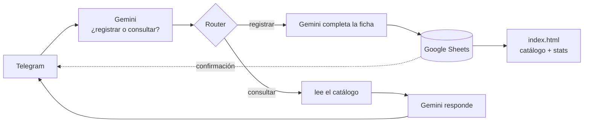

# Diario de proyección

Un registro personal de películas — ~1.280 vistas desde enero de 2018 — que se
mantiene solo: le mandás el nombre de una película a un bot de Telegram, una IA
le completa director, año, país y género, y la fila se agrega a una hoja de
Google. Un sitio web lee esa hoja en vivo y muestra el catálogo y sus
estadísticas.

**Sitio:** https://arturogrottoli.github.io/IA-Automation-Movies/

Proyecto integrador del curso **IA Automation** (Coderhouse). Toca las tres capas
del stack: datos, orquestación e inteligencia.

## Estado

**Funcional de punta a punta.** El circuito Telegram → IA → Google Sheets → web
anda solo: agregás una película por chat y aparece en el sitio sin tocar nada más.

### Hecho
- [x] **Registro por chat.** "vi Whiplash" → IA completa la ficha → fila en la hoja.
- [x] **Sitio + estadísticas** en vivo (5 gráficos + índice paginado).
- [x] **Consultas al bot.** "¿qué vi de Cronenberg?" → responde leyendo la hoja.
- [x] **Recomendaciones.** "recomendame un thriller" → sugiere pelis no vistas.
- [x] **Pósters, ratings y géneros (TMDB).** Grilla de tarjetas + gráfico y
      filtro por género + columna de rating.
- [x] **Lista "quiero ver".** "quiero ver X" → pestaña `por_ver` + sección en el
      sitio; al registrarla como vista sale sola de la lista.
- [x] **Human-in-the-loop.** "vi X" → el bot muestra la ficha con botones
      **✅ Sí / ❌ No**; recién guarda (como `Aprobada`) cuando tocás ✅.
- [x] Limpieza de `cerebro/` y del repo.

### Pendiente — funcionalidad
- [ ] **HITL: el botón ❌.** Hoy ✅ guarda y confirma. Falta la rama del `no`
      (editar el mensaje a "descartada") y el `answerCallbackQuery` para que el
      botón no quede girando.
- [ ] **Sacar el módulo temporal** `Make an API Call` (#21, el del `setWebhook`)
      del escenario de Make — ya cumplió.
- [ ] **Que las consultas vean la lista "quiero ver".** La rama "consultar" de
      Make baja solo la hoja de vistas — falta un HTTP más que baje `por_ver` y
      pasarle las dos listas a Gemini. Así entiende "¿qué tengo anotado?".
- [ ] **Sacar pelis de la lista por bot.** Hoy: borrar la fila en la pestaña
      `por_ver` a mano. Automático = intent `descartar` + Search/Delete Row en Make.
- [ ] **Pósters de la watchlist automáticos.** Hoy `build_posters.js` los trae al
      re-correrlo; sumar un paso de TMDB a la rama `agendar` de Make.
- [ ] **Similitud por embeddings.** "pelis parecidas a X", "director parecido a otro".
- [ ] Los ~8 títulos que TMDB no tiene (imágenes a mano en `img/`).

### Pendiente — para cerrar el curso
- [x] **Mapa de arquitectura** → [docs/arquitectura.md](docs/arquitectura.md) (falta exportar a PDF).
- [x] **Manual de datos** → [docs/manual-de-datos.md](docs/manual-de-datos.md).
- [x] **Optimización de costos** → [docs/costos.md](docs/costos.md).
- [ ] **Error Handler en Make** (si Gemini falla, hoy se pierde la fila).
- [ ] **Panel de KPIs de operación** (tasa de aprobación, volumen, errores — máx 4).
- [ ] **Video demo de 3 min.**

### Deuda técnica menor
- [ ] **Fechas de visionado (`fecha_vista`) con el año corrido.** Bloques enteros:
      la lista "2018" tiene fechas de 2019, la "2021" de 2022, la "2025" de 2026
      (algunas caen en el futuro). Hay que restar 1 al año en esos rangos.
      Es lo que más falta acomodar. Con `check_datos.js` / Find&Replace por rango.
- [ ] **Celdas con año/director mal** (de `cerebro/check_datos.js`, verificadas).
      Hecho: `D713` `E733` `E509` `E551` `E342` `E1000`.
      Falta: `D942` The Assessment → `Fleur Fortuné` + `E942` → `2024` · `E659` Labyrinth → `1986`.
- [ ] **`por_ver`:** fila 5 The Other → `Robert Mulligan` / `1972` ·
      fila 8 Amarga Navidad → `Pedro Almodóvar` / `2026` / `España` ·
      fila 9 Charly días de sangre → `Carlos Galettini`.
- [ ] `posters.json` matcheó mal ~70 pelis (remakes/homónimos) — regenerar con un
      match más estricto por año. La hoja está bien; solo el póster.
- [ ] Falta la imagen de `img/los-gatos.jpg` (TMDB no tiene la argentina de 1986).
- [ ] Recalcular `anio_visto` = año de `fecha_vista` una vez arregladas las fechas.
- [ ] Evaluar migrar el sitio a un framework (React / Next / Astro). Hoy es HTML
      plano sin dependencias — funciona bien; tendría sentido si crece mucho o
      como pieza de portfolio que demuestre ese stack.

## Cómo funciona



| Capa | Herramienta | Rol |
|---|---|---|
| **Cerebro** | Google Sheets | El catálogo. Una tabla, 17 columnas. |
| **Corazón** | Make | Clasifica el mensaje, bifurca, llama a la IA, escribe o responde. |
| **Inteligencia** | Google Gemini | Clasifica intención · del título saca la ficha · responde consultas con el catálogo como contexto. |
| **Voz** | Telegram + `index.html` | Entrada y consultas por chat; catálogo y stats por web. |

El sitio es un solo archivo, sin dependencias ni build. Lee el CSV publicado de la
hoja; si no hay conexión, cae a una instantánea embebida.

El bot distingue tres cosas por el texto del mensaje:
- **"vi X"** → registra la película.
- **"¿qué vi de X?"** → responde con lo que hay en el catálogo.
- **"recomendame algo de X"** → sugiere películas fuera del catálogo.

## Estructura

```
index.html            el sitio (5 gráficos + índice: lista o grilla de pósters)
posters.json          póster, rating y género por película (de TMDB)
posters-manual.json   los ~8 que TMDB no tiene (imágenes en img/)
docs/                 entregables del curso — arquitectura, datos, costos
cerebro/
  catalogo_completo.csv   copia portable de las ~1.280 películas
  build_site.js           refresca la instantánea embebida de index.html
  build_posters.js        regenera posters.json desde TMDB (token en tmdb.key)
  CONFIG.md               dónde vive cada secreto (todos en Make, ninguno acá)
  README.md               notas sobre los datos
```

## Datos en vivo

1. En la hoja: *Archivo → Compartir → Publicar en la Web → pestaña
   `catalogo_completo` → CSV*.
2. Pegar esa URL en `SHEET_CSV_URL`, arriba del `<script>` de `index.html`.

Sin eso, el sitio funciona igual con la instantánea (`node cerebro/build_site.js`
la actualiza).
