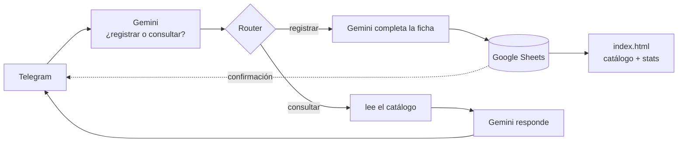

# Diario de proyección

Un registro personal de películas — ~1.280 vistas desde enero de 2018 — que se
mantiene solo: le mandás el nombre de una película a un bot de Telegram, una IA
le completa director, año, país y género, y la fila se agrega a una hoja de
Google. Un sitio web lee esa hoja en vivo y muestra el catálogo y sus
estadísticas.

**Sitio:** https://arturogrottoli.github.io/IA-Automation-Movies/

Proyecto integrador del curso **IA Automation** (Coderhouse). Toca las tres capas
del stack: datos, orquestación e inteligencia.

## Estado

**Funcional de punta a punta.** El circuito Telegram → IA → Google Sheets → web
anda solo: agregás una película por chat y aparece en el sitio sin tocar nada más.

### Hecho
- [x] **Registro por chat.** "vi Whiplash" → IA completa la ficha → fila en la hoja.
- [x] **Sitio + estadísticas** en vivo (catálogo buscable + 4 gráficos).
- [x] **Consultas al bot.** "¿qué vi de Cronenberg?" → responde leyendo la hoja.
- [x] **Recomendaciones.** "recomendame un thriller" → sugiere pelis no vistas.
- [x] **Pósters, ratings y géneros (TMDB).** Vista de grilla con tarjetas +
      gráfico por género + filtro por género + columna de rating.
- [x] Limpieza de `cerebro/` y del repo.

### Pendiente — funcionalidad
- [ ] **Lista "quiero ver".** Pestaña `por_ver`, intent `agendar` en el bot; al
      registrarla como vista sale de la lista.
- [ ] **Pósters para las nuevas.** Hoy `posters.json` se regenera a mano
      (`node cerebro/build_posters.js`); sumar el paso de TMDB a Make.
- [ ] **Similitud por embeddings.** "pelis parecidas a X", "director parecido a otro".
- [ ] Los ~70 títulos con typo que TMDB no matcheó (corregirlos en la hoja).
- [ ] **Human-in-the-loop.** Botones *Aprobar / Editar / Rechazar* antes de guardar.

### Pendiente — para cerrar el curso
- [ ] **Diagrama de arquitectura** (PE1, PDF).
- [ ] **Error Handler en Make** (si Gemini falla, hoy se pierde la fila).
- [ ] **Cuadro de optimización de costos** (Gemini gratis vs pago, batch vs tiempo real).
- [ ] **Panel de KPIs de operación** (tasa de aprobación, volumen, errores — máx 4).
- [ ] **Manual de datos** formal.
- [ ] **Video demo de 3 min.**

### Deuda técnica menor
- [ ] Limpiar del catálogo unas filas con fecha de visionado mal cargada.
- [ ] Evaluar migrar el sitio a un framework (React / Next / Astro). Hoy es HTML
      plano sin dependencias — funciona bien; tendría sentido si crece mucho o
      como pieza de portfolio que demuestre ese stack.

## Cómo funciona



| Capa | Herramienta | Rol |
|---|---|---|
| **Cerebro** | Google Sheets | El catálogo. Una tabla, 17 columnas. |
| **Corazón** | Make | Clasifica el mensaje, bifurca, llama a la IA, escribe o responde. |
| **Inteligencia** | Google Gemini | Clasifica intención · del título saca la ficha · responde consultas con el catálogo como contexto. |
| **Voz** | Telegram + `index.html` | Entrada y consultas por chat; catálogo y stats por web. |

El sitio es un solo archivo, sin dependencias ni build. Lee el CSV publicado de la
hoja; si no hay conexión, cae a una instantánea embebida.

El bot distingue tres cosas por el texto del mensaje:
- **"vi X"** → registra la película.
- **"¿qué vi de X?"** → responde con lo que hay en el catálogo.
- **"recomendame algo de X"** → sugiere películas fuera del catálogo.

## Estructura

```
index.html            el sitio (5 gráficos + índice: lista o grilla de pósters)
posters.json          póster, rating y género por película (de TMDB)
cerebro/
  catalogo_completo.csv   copia portable de las ~1.280 películas
  build_site.js           refresca la instantánea embebida de index.html
  build_posters.js        regenera posters.json desde TMDB (token en tmdb.key)
  CONFIG.md               dónde vive cada secreto (todos en Make, ninguno acá)
  README.md               notas sobre los datos
```

## Datos en vivo

1. En la hoja: *Archivo → Compartir → Publicar en la Web → pestaña
   `catalogo_completo` → CSV*.
2. Pegar esa URL en `SHEET_CSV_URL`, arriba del `<script>` de `index.html`.

Sin eso, el sitio funciona igual con la instantánea (`node cerebro/build_site.js`
la actualiza).
