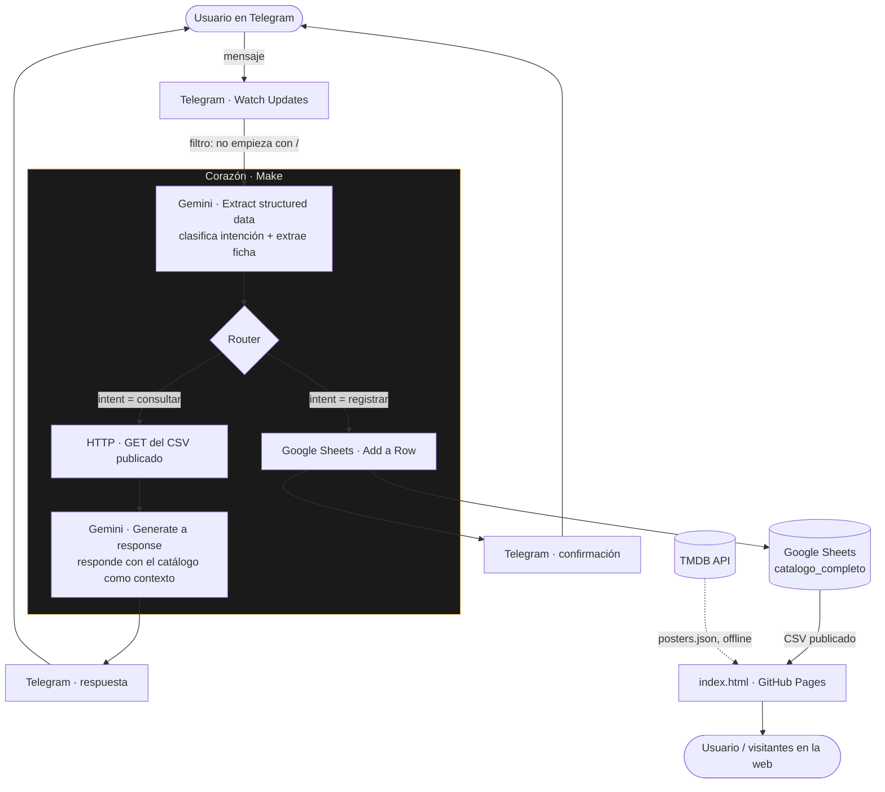

# Mapa de arquitectura

Proyecto **Diario de proyección** — ecosistema autónomo de punta a punta para
registrar y consultar un catálogo personal de películas.

## Las tres capas

| Capa | Qué es | Herramienta |
|---|---|---|
| **Cerebro** — los datos | El catálogo. Una tabla (`catalogo_completo`), 17 columnas, ~1.280 filas. Fuente de verdad única. | Google Sheets |
| **Corazón** — la lógica | Escucha el bot, clasifica la intención, llama a la IA, y según el caso escribe una fila o responde. | Make + Google Gemini |
| **Voz** — entrada y salida | El chat para registrar y preguntar; la web para explorar el catálogo y las estadísticas. | Telegram + sitio estático (GitHub Pages) |

## Diagrama de flujo



## Los dos caminos

### 1. Registrar una película (con HITL)
```
"vi Whiplash"
  → Watch Updates capta el mensaje
  → filtro descarta comandos (/start…) · Router: solo mensajes de texto van a Gemini
  → Gemini clasifica: intent = registrar; extrae titulo_corregido, director,
    anio_estreno, pais_origen, genero
  → Router → rama "registrar" → Telegram: manda la ficha con botones [✅ Sí] [❌ No]

  (el usuario toca ✅)
  → Watch Updates capta el callback_query · Router → rama "Aprobado"
  → Text parser lee la ficha del mensaje
  → Add a Row en catalogo_completo (fórmulas por-fila para id, numero,
    es_revisionado; fecha_vista = hoy; fuente = Bot Telegram;
    estado_enriquecimiento = Aprobada)
  → Telegram: "✅ Guardada: Whiplash"
```

### 2. Consultar / recomendar
```
"¿qué vi de Cronenberg?"  ·  "recomendame un thriller"
  → Watch Updates capta el mensaje
  → Gemini clasifica: intent = consultar; consulta = pregunta reformulada
  → Router → rama "consultar"
  → HTTP GET al CSV publicado de la hoja (el catálogo entero, ~1.280 filas)
  → Gemini responde la consulta con el CSV como contexto
    (para recomendaciones: sugiere títulos que NO están en el catálogo)
  → Telegram: la respuesta
```

## El sitio

`index.html` es un solo archivo, sin build ni dependencias. Al cargar:

1. `fetch` al CSV publicado de la hoja → datos en vivo (cae a una instantánea
   embebida si no hay conexión).
2. `fetch` a `posters.json` + `posters-manual.json` → póster, rating y género
   por película (de TMDB; los ~8 que TMDB no tiene se cargan a mano en `img/`).
3. Renderiza: 6 tiles de stats, 5 gráficos SVG (sin librería), lista de
   revisiones, e índice completo en vista lista o grilla.

Cada `git push` a `main` redeploya GitHub Pages solo.

## Componentes y dónde vive cada cosa

| Componente | Ubicación | Notas |
|---|---|---|
| Bot | @ListadoPelisBot (Telegram) | creado con BotFather |
| Orquestación | Make · escenario "Telegram Bot, Google Sheets" | 1 trigger, 1 router, 2 ramas |
| IA | Google Gemini (`gemini-2.5-flash`) | 2 llamadas: clasificar/extraer y responder |
| Base de datos | Google Sheet · pestaña `catalogo_completo` | publicada como CSV para lectura |
| Pósters | `posters.json` (TMDB) + `posters-manual.json` + `img/` | generados por `cerebro/build_posters.js` |
| Sitio | `index.html` en GitHub Pages | `arturogrottoli.github.io/IA-Automation-Movies` |
| Secretos | conexiones de Make (token de Telegram, key de Gemini) · `cerebro/tmdb.key` (local, ignorado) | nada de esto en el repo |

## Requisitos del proyecto integrador

| Requisito | Cómo se cumple |
|---|---|
| **Autónomo** | El circuito Telegram → IA → Sheets → web corre solo, sin intervención. |
| **Resiliente** | *Pendiente:* falta Error Handler en Make (si Gemini devuelve 503, hoy se pierde la fila). |
| **Con HITL** | ✅ "vi X" → el bot propone la ficha con botones ✅/❌; recién escribe (como `Aprobada`) al tocar ✅. Falta cerrar la rama del ❌. |
| **Limpio** | Una sola fuente de verdad (la hoja); filtro anti-comando; secretos fuera del repo. |
