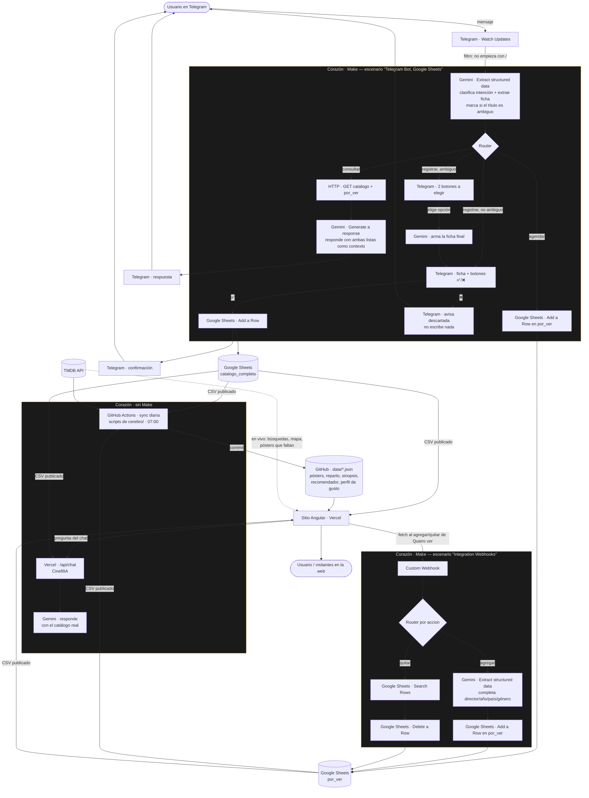

# Mapa de arquitectura

Proyecto **Diario de proyección** — ecosistema autónomo de punta a punta para
registrar y consultar un catálogo personal de películas.

## Las tres capas

| Capa | Qué es | Herramienta |
|---|---|---|
| **Cerebro** — los datos | Dos tablas: `catalogo_completo` (~1.310 filas, una por visionado) y `por_ver` (watchlist, ~65 filas). Fuente de verdad única. Alrededor, los datos enriquecidos de TMDB y de los modelos de machine learning, en `data/` del repo, que se regeneran solos todos los días. | Google Sheets + GitHub (`data/`) |
| **Corazón** — la lógica | Dos escenarios de Make. "Telegram Bot, Google Sheets": escucha el chat, clasifica la intención, llama a la IA, y según el caso escribe/lee una fila o responde. "Integration Webhooks": recibe pedidos del sitio (agregar/quitar de `por_ver`). Más dos piezas sin Make: la función de CinefilIA en Vercel y la sincronización diaria en GitHub Actions. | Make + Google Gemini + Vercel Functions + GitHub Actions |
| **Voz** — entrada y salida | El chat de Telegram para registrar, agendar y preguntar. El sitio, en dos secciones: **Películas** (índice, listas, búsquedas, mapa) y **Datos** (gráficos y machine learning), con CinefilIA, un chat de cine, en todas las páginas. | Telegram + sitio en Angular (Vercel) |

## Diagrama de flujo


```mermaid
flowchart TD
    U([Usuario en Telegram]) -->|mensaje| WU[Telegram · Watch Updates]
    WU -->|filtro: no empieza con /| G1

    subgraph CORAZON ["Corazón · Make — escenario #quot;Telegram Bot, Google Sheets#quot;"]
      G1[Gemini · Extract structured data<br/>clasifica intención + extrae ficha<br/>marca si el título es ambiguo]
      G1 --> R{Router}
      R -->|registrar, no ambiguo| HITL[Telegram · ficha + botones ✅/❌]
      R -->|registrar, ambiguo| AMB[Telegram · 2 botones a elegir]
      AMB -->|elige opción| G3[Gemini · arma la ficha final] --> HITL
      HITL -->|✅| ADD[Google Sheets · Add a Row]
      HITL -->|❌| DESC[Telegram · avisa descartada<br/>no escribe nada]
      R -->|agendar| ADDPV[Google Sheets · Add a Row en por_ver]
      R -->|consultar| HTTP[HTTP · GET catalogo + por_ver]
      HTTP --> G2[Gemini · Generate a response<br/>responde con ambas listas como contexto]
    end

    subgraph WEBHOOKS ["Corazón · Make — escenario #quot;Integration Webhooks#quot;"]
      WH[Custom Webhook] --> R2{Router por accion}
      R2 -->|agregar| G4[Gemini · Extract structured data<br/>completa director/año/país/género] --> ADD2[Google Sheets · Add a Row en por_ver]
      R2 -->|quitar| SR[Google Sheets · Search Rows] --> DEL[Google Sheets · Delete a Row]
    end

    subgraph SINMAKE ["Corazón · sin Make"]
      GH[GitHub Actions · sync diaria<br/>scripts de cerebro/ · 07:00]
      API[Vercel · /api/chat<br/>CinefilIA]
      API --> G5[Gemini · responde<br/>con el catálogo real]
    end

    ADD --> S[(Google Sheets<br/>catalogo_completo)]
    ADDPV --> PV[(Google Sheets<br/>por_ver)]
    ADD2 --> PV
    DEL --> PV
    ADD --> C1[Telegram · confirmación]
    G2 --> C2[Telegram · respuesta]

    S -->|CSV publicado| GH
    PV -->|CSV publicado| GH
    TMDB[(TMDB API)] --> GH
    GH -->|commit| DATA[(GitHub · data/*.json<br/>pósters, reparto, sinopsis,<br/>recomendador, perfil de gusto)]

    S -->|CSV publicado| WEB[Sitio Angular · Vercel]
    PV -->|CSV publicado| WEB
    DATA --> WEB
    TMDB -.->|en vivo: búsquedas, mapa,<br/>pósters que faltan| WEB
    WEB -->|fetch al agregar/quitar de Quiero ver| WH
    WEB -->|pregunta del chat| API
    S -->|CSV publicado| API

    C1 --> U
    C2 --> U
    DESC --> U
    WEB --> U2([Usuario / visitantes en la web])

    style CORAZON fill:#1a1a1a,stroke:#e6a94a,color:#ece6da
    style WEBHOOKS fill:#1a1a1a,stroke:#e6a94a,color:#ece6da
    style SINMAKE fill:#1a1a1a,stroke:#e6a94a,color:#ece6da
```

## Los caminos

### 1. Registrar una película (con HITL, con desambiguación)
```
"vi Whiplash"
  → Watch Updates capta el mensaje
  → filtro descarta comandos (/start…) · Router: solo mensajes de texto van a Gemini
  → Gemini clasifica: intent = registrar; extrae titulo_corregido, director,
    anio_estreno, pais_origen, genero; marca ambiguo = true/false

  → si ambiguo = true (ej. "vi cape fear"): Telegram manda 2 botones
    (la original de 1962 / el remake de 1991) → al elegir, un segundo
    llamado a Gemini arma la ficha completa sobre esa opción

  → Router → ficha lista → Telegram: manda la ficha con botones [✅ Sí] [❌ No]

  (el usuario toca ✅)
  → Watch Updates capta el callback_query · Router → rama "Aprobado"
  → Add a Row en catalogo_completo (fórmulas por-fila para id, numero,
    es_revisionado; fecha_vista = hoy; fuente = Bot Telegram;
    estado_enriquecimiento = Aprobada)
  → Telegram: "✅ Guardada: Whiplash"

  (el usuario toca ❌)
  → Router → rama "Rechazado": no escribe nada
  → Telegram: avisa que se descartó, invita a reintentar si fue sin querer
```

### 2. Agendar ("quiero ver")
```
"quiero ver Perfect Blue"
  → Gemini clasifica: intent = agendar; extrae titulo/director/anio/pais
  → Router → rama "agendar" → Add a Row en por_ver (sin paso de HITL)
```

### 3. Consultar / recomendar por Telegram
```
"¿qué vi de Cronenberg?"  ·  "¿qué tengo pendiente por ver?"  ·  "recomendame un thriller"
  → Gemini clasifica: intent = consultar; consulta = pregunta reformulada
  → Router → rama "consultar"
  → HTTP GET al CSV publicado de catalogo_completo + HTTP GET a por_ver
  → Gemini responde con ambas listas como contexto, distinguiendo vistas
    de pendientes (para recomendaciones: sugiere títulos que NO están en
    ninguna de las dos)
  → Telegram: la respuesta
```

### 4. Agregar/quitar de "Quiero ver" desde el sitio
```
Click en "+ Agregar película" (sitio) → POST al Custom Webhook con el título
  → Router por accion = "agregar" → Gemini completa director/año/país/género
    a partir del título libre (mismo patrón que el bot) → Add a Row en por_ver

Click en la X de una card / "Quitar de la lista" en el modal → POST con accion = "quitar"
  → Search Rows (título + año) → Delete a Row en por_ver
```

### 5. Preguntarle a CinefilIA en el sitio (sin Make)
```
"¿Qué vi de Tarantino?"  ·  "Recomendame una de terror de los 80"  ·  "¿cómo hago una torta?"
  → el chat del sitio hace POST a /api/chat (función de Vercel; la clave de
    Gemini vive en Vercel, nunca en el navegador)
  → la función arma el contexto: resumen ya contado (totales, por año, por
    director: los modelos cuentan mal), títulos de todas las vistas y el
    detalle solo de las relacionadas con la pregunta, más "Quiero ver"
  → Gemini responde. Si no es sobre cine: "Solo soy un simple bot peliculero"
  → si es un pedido de recomendación, la función verifica cada título contra
    el catálogo real; si recomendó algo ya visto, repite la consulta
    excluyéndolo (hasta 2 veces) y saca lo que quede
  → límite de 15 consultas cada 10 minutos por persona
```

### 6. Sincronización diaria de los datos (sin Make)
```
GitHub Actions, todos los días a las 07:00 (y a mano desde la pestaña Actions)
  → respaldo de la hoja → cerebro/catalogo_completo.csv
  → scripts de TMDB: pósters, reparto, duración, sinopsis (solo lo nuevo)
  → scripts de Python: perfil de gusto (scikit-learn) y los dos recomendadores
  → commit en data/ solo si algo cambió → el sitio lo toma en la próxima carga
```

## El sitio

App en Angular 20 (carpeta `app/`, standalone + signals), con dos secciones
(rutas `/` y `/datos`):

| **Películas** | **Datos** |
|---|---|
| I · El índice completo (grilla o lista, "Últimas vistas") | I · La forma de una obsesión (6 gráficos) |
| II · Quiero ver | II · Revisitas |
| III · ¿Cuánto vi de…? (buscar actor/director) | III · Detrás de los datos (la limpieza) |
| IV · Recomendador (parecidas dentro del diario) | IV · Dashboard |
| V · Mis 9 películas (imagen para compartir) | V · Perfil de gusto (machine learning) |
| VI · Mapa del mundo (vistas por país + sugerencias) | VI · KPIs de operación |

Al cargar:

1. `fetch` al CSV publicado de `catalogo_completo` y de `por_ver` → datos en
   vivo (cae a una instantánea del catálogo, `app/public/data/catalog-snapshot.json`,
   si la hoja no responde).
2. `fetch` a los JSON de `data/` en el repo de GitHub: pósters, rating,
   género, reparto, duración, sinopsis, los dos recomendadores y el perfil de
   gusto. Los que TMDB no tiene se cargan a mano en `img/` +
   `posters-manual.json`.
3. Si una película todavía no pasó por la sincronización diaria (se agregó
   hoy), el sitio busca su póster en TMDB en el momento.
4. En vivo contra TMDB: la búsqueda por persona, las sugerencias del mapa, la
   ficha de películas que no están en el catálogo y los fotogramas de la portada.

Los gráficos de Datos tienen un selector compartido **"Sin repetir /
Contando repetidas"**: cada película una vez, o cada visionado.

Cada `git push` a `main` redeploya Vercel solo. Los JSON de `data/` se leen
directo del repo, así que actualizarlos no necesita redeploy.

## Componentes y dónde vive cada cosa

| Componente | Ubicación | Notas |
|---|---|---|
| Bot | @ListadoPelisBot (Telegram) | creado con BotFather |
| Orquestación (bot) | Make · escenario "Telegram Bot, Google Sheets" | 1 trigger, router de intención, ramas registrar/agendar/consultar |
| Orquestación (sitio) | Make · escenario "Integration Webhooks" | 1 Custom Webhook, router por `accion` (agregar/quitar) |
| IA del bot | Google Gemini (`gemini-3.1-flash-lite`) en Make | clasificar/extraer, desambiguar, responder, completar título libre del sitio |
| CinefilIA | `app/api/chat.ts` (función de Vercel) → Gemini, proyecto propio | chat de cine del sitio; cuota separada de la del bot |
| Sincronización de datos | `.github/workflows/sync-datos.yml` (GitHub Actions) | todos los días; corre los scripts de `cerebro/` |
| Base de datos | Google Sheet · pestañas `catalogo_completo` y `por_ver` | publicadas como CSV para lectura |
| Datos enriquecidos | `data/*.json` + `img/` | generados por `cerebro/`, ver [manual-de-datos.md](manual-de-datos.md) |
| Sitio | `app/` (Angular) en Vercel | `turimoviesdatabase.vercel.app` |
| Secretos | Make (Telegram, Gemini del bot) · Vercel (`GEMINI_API_KEY` de CinefilIA) · GitHub (`TMDB_TOKEN`) · `cerebro/tmdb.key` local | nada en el repo; detalle en `cerebro/CONFIG.md` |

## Requisitos del proyecto integrador

| Requisito | Cómo se cumple |
|---|---|
| **Autónomo** | El circuito Telegram → IA → Sheets → web corre solo, sin intervención. Desde octubre, también el enriquecimiento: la sincronización diaria trae pósters, reparto, sinopsis y recalcula los modelos sin correr nada a mano. |
| **Resiliente** | *Pendiente en Make:* falta Error Handler (si Gemini devuelve 503, hoy se pierde la fila). Del lado del sitio: instantánea si la hoja no responde, póster en vivo si falta el dato, CinefilIA reintenta ante "alta demanda" de Gemini y nunca devuelve una respuesta vacía, la sincronización no pisa el respaldo si Google falla. |
| **Con HITL** | ✅ "vi X" → el bot propone la ficha con botones ✅/❌; recién escribe (como `Aprobada`) al tocar ✅. La rama del ❌ no guarda nada y avisa que se descartó. |
| **Limpio** | Una sola fuente de verdad (la hoja); filtro anti-comando; secretos fuera del repo; datos derivados separados en `data/`. |
